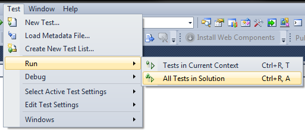
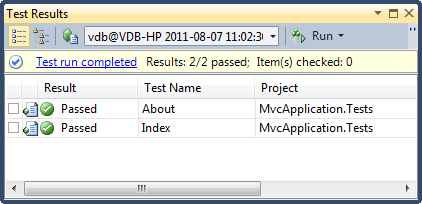

# ASP.NET MVC: Mocking Session State

## Introduction

A couple of months ago I wrote a post on unit testing using [NUnit & Moq](http://cgeers.com/2011/05/07/nunit-moq/) which showed how you can use the Moq framework to remove database dependencies from your unit tests.

Last week I got a question about how to mock the session state when unit testing your controller actions. This can be quickly achieved using the [MVC Contrib](http://mvccontrib.codeplex.com/) library provided by the [Outercurve Foundation](http://www.outercurve.org/).

It contains a TestHelper library which helps you to quickly create unit tests and reduce your workload. Let's see how we can use it to our advantage...

## Hello, World!

First we need to create a demo ASP.NET MVC application for which we can write unit tests. Start up Visual Studio 2010 and create a new blank solution called "SessionState". Next add a new ASP.NET MVC 3 Web Application to the solution originally called "MvcApplication". Be sure to choose the Internet Application template and check the "Create a unit test project" option.


Once you click OK Visual Studio will add a new ASP.NET MVC 3 project and a unit test project to your solution. The unit test project already contains two unit tests for the web application's HomeController. Just open the HomeControllerTest.cs file. You can run them by clicking Test > Run > All Tests in Solution.





Everything is well. The tests pass. Now let's break them!

## Breaking the Unit Tests

Let's quickly break a unit test. Open the HomeController code file and adjust the About() action method so that it resembles the following listing.

```csharp
public ActionResult About()
{
    Session["FooBar"] = "BOOM";

    return View();
}
```

If you run the web application you won't notice a difference, but if you run the unit tests you'll notice that one of them blows up because the Session object is not set to an instance of an object (it is NULL).


## MVC Contrib

Let's fix the broken unit test by introducing the TestHelper library offered by the MVC Contrib project. I downloaded this library via [NuGet](http://www.hanselman.com/blog/IntroducingNuPackPackageManagementForNETAnotherPieceOfTheWebStack.aspx) by adding a library package reference to the unit tests project (MvcApplication.Tests). The id of the package is "MvcContrib.Mvc3.TestHelper-ci". At the time of writing it is at version 3.0.81.0.


If you are not familiar with NuGet yet, be sure to read up on it. You can also download the library (MVCContrib.Extras.release.zip) from [CodePlex](http://mvccontrib.codeplex.com/release). Make sure you download the MVC 3 version.

Now we need to fix the HomeController unit tests. Open up the HomeControllerTests.cs code file and add "MvcContrib.TestHelper" to the using statements. Next we need to adjust the unit test for the About() action method. By simply adding two lines (TestControllerBuilder) we are able to mock the session state!

```csharp
[TestMethod]
public void About()
{
    TestControllerBuilder builder = new TestControllerBuilder();

    // Arrange
    HomeController controller = new HomeController();

    builder.InitializeController(controller);

    // Act
    ViewResult result = controller.About() as ViewResult;

    // Assert
    Assert.IsNotNull(result);
}
```

The TestController's InitializeController(...) method takes our controller (HomeController) and initializes its internal data members (HttpContext, HttpSession, TempData...) correctly. If you re-run the tests they'll pass.


If you debug the tests and put a breakpoint after the controller has been initialized you'll notice that the session object has been mocked.


That's all there is too it. Just add a reference to the MvcContrib.TestHelper library, create a TestControllerBuilder instance and initialize the controller. Voila, you can now create unit tests for controller action methods which depend on the session state.
